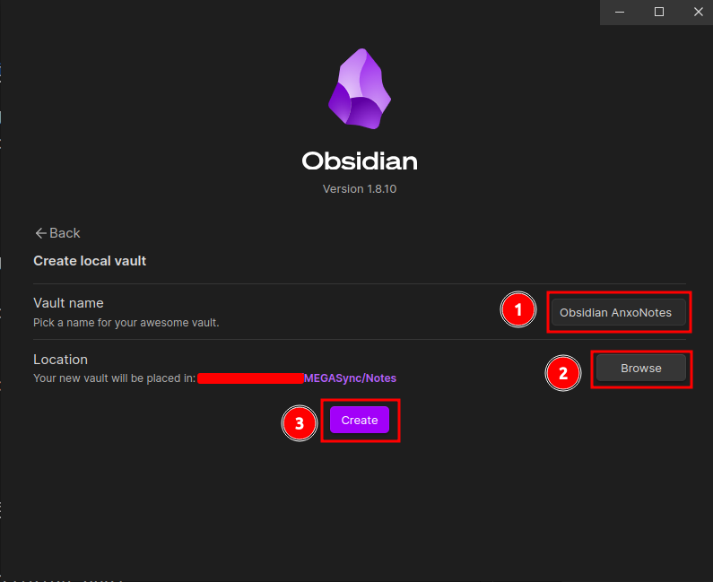

# Installation

Obsidian est disponible sur les systèmes iOS, Android, Windows, Mac, Linux. Il es également disponible au niveau des navigateurs sous forme d’extension du navigateur.

Pour installer Obsidian,

1. Rendez-vous sur la page [Obsidian/download](https://obsidian.md/download)
2. Cliquez sur l'environnement sur lequel vous voulez installer Obsidian pour télécharger l'installateur.
3. Installer Obsidian sur votre machine.

## Installation de Obsidian sur les différentes plateformes

### Sur Windows et Mac

Double cliquez sur l'exécutable Obsidian, puis suivez les instructions.

### Sur Linux Debian/ Ubuntu (deb)

```bash
sudo dpkg -i obsidian.deb
```

### Sur Linux Debian/ Ubuntu (AppImage)

```
sudo chmod +x Obsidian.AppImage
./Obsidian.AppImage
```

## **Création d'un coffre**

* À la première ouverture de Obsidian, vous êtes amené à créer un coffre. Choisissez la langue puis cliquez sur **Create**.


* Renseignez les informations de votre coffre comme son nom et son emplacement sur votre machine.



* Présentation de l'interface de Obsidian


