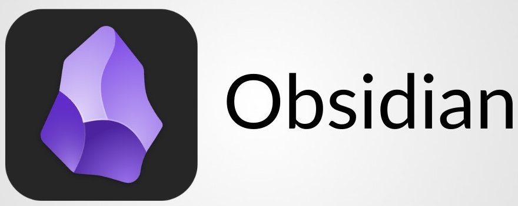

# Introduction

<figure><figcaption></figcaption></figure>

Cette documentation présente une vue d’ensemble claire des **principes de fonctionnement d’Obsidian**, ses usages concrets en guidant l’utilisateur dans ses **premiers pas**, sa **prise en main** et la **personnalisation** de son environnement de travail.

Elle s’adresse principalement aux utilisateurs techniques, professionnels de l’IT, étudiants, chercheurs, ou toute personne ayant besoin de centraliser, relier et structurer ses idées de manière flexible et évolutive.

Pour profiter pleinement de cet outils, vous devez :&#x20;

* Savoir manipuler des fichiers et dossiers sur votre ordinateur ou Smartphone,
* Avoir une volonté de structurer ses notes, pensées ou ses projets

***

`#documentation` `#productivité` `#note-taking` `#obsidian` `#PKM` `#Zettelkasten` `#Markdown`
