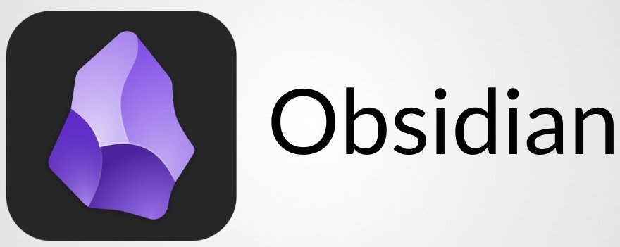

# Présentation

## Qu'est-ce qu'Obsidian ?

Obsidian est un outil de prise de notes et de gestion des connaissances révolutionnaire qui transforme votre façon de créer, organiser et connecter vos idées et créer une knowledge base (base de connaissances). L'innovation d'Obsidian réside dans sa capacité à créer des liens entre vos notes grâce à des métadonnées associées à chaque note, transformant votre collection de notes en un réseau de connaissances interconnecté. Obsidian s'appuie sur la méthode **Zettelkasten**.

## Qu'est-ce que le Zettelkasten ?

Zettelkasten signifie littéralement "boîte de notes" en allemand. Cette méthode révolutionnaire a été élaborée par Niklas Luhmann, chercheur en sociologie et philosophie, entre les années 1960 et 1990. L'enjeu central du Zettelkasten est de faire des liens entre les notes grâce à des métadonnées associées à chaque note.

La méthode des liens ne vient pas de nulle part. Elle s'appuie sur le fonctionnement naturel de notre cerveau qui crée des associations entre les concepts. Cette approche permet l'émergence d'idées nouvelles par connexion, la redécouverte d'informations pertinentes, et la construction progressive d'une pensée complexe.

## Composantes

### Liens

Les liens vous permettent de lier n'importe quoi et tout - des idées, des gens, des lieux, des livres, et au-delà, d'nventez votre propre Wikipédia.

### Graphes

Les graphes permettent de visualisez les relations entre vos notes. Ils aident à trouvez des motifs cachés dans votre réflexion à travers un graphique visuellement engageant et interactif.

### Canvas

Les canvas proposent un espace infini pour rechercher, réfléchir, schématiser et organiser vos idées. Canvas est un terrain de jeu illimité pour votre esprit.

### Extensions

Les exetension d'Obsidian permettent de personnaliser votre espace de travail. Grâce à des milliers de plugins et à notre API ouverte, il est facile d'adapter Obsidian à votre flux de travail personnel.

## Cas d'Usage Principaux

Des notes personnelles aux journaliers, bases de connaissances et gestion de projets, Obsidian vous donne les outils pour trouver des idées et les organiser.

### Recherche Académique

Obsidian excelle dans la prise de notes de lecture, la synthèse et l'analyse de sources, la rédaction de mémoires ou thèses, et la gestion bibliographique. Les liens entre concepts facilitent la construction d'argumentaires complexes.

### Gestion de Projets

L'outil sert efficacement pour la planification et le suivi de projets, la documentation technique, les retours d'expérience, et la création de bases de connaissances d'équipe. La flexibilité d'organisation s'adapte à différentes méthodologies.

### Développement Personnel

Obsidian accompagne le journal personnel, le suivi d'objectifs, l'apprentissage continu, et la réflexion introspective. Les liens permettent de connecter expériences, apprentissages et insights personnels.

### Création de Contenu

L'outil facilite la planification éditoriale, la recherche et documentation, la structuration d'idées, et la collaboration créative. Les connections entre notes favorisent l'émergence d'angles originaux.
