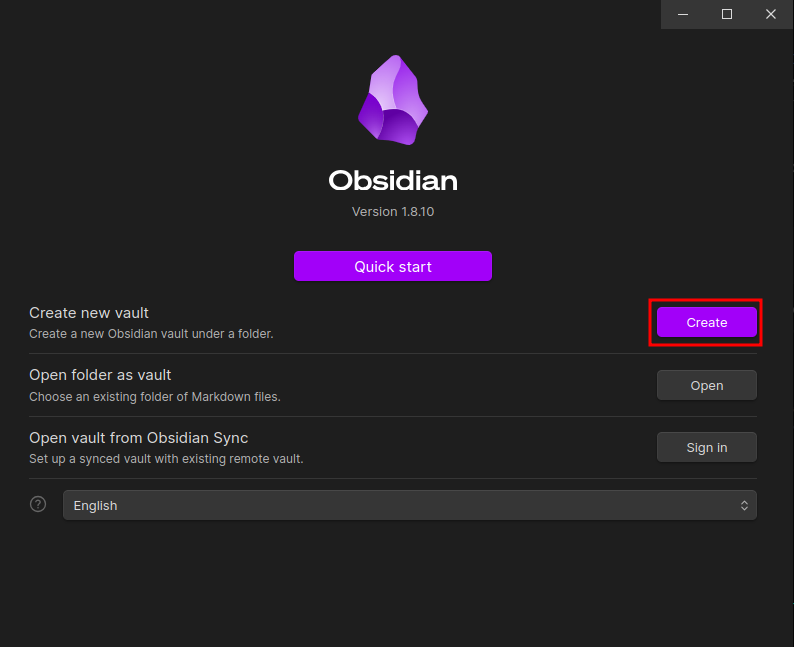
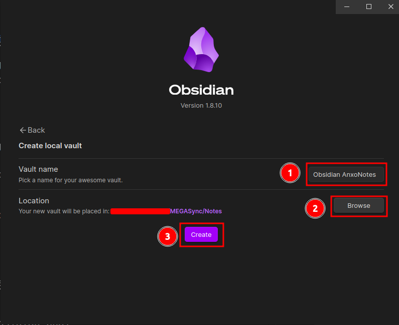
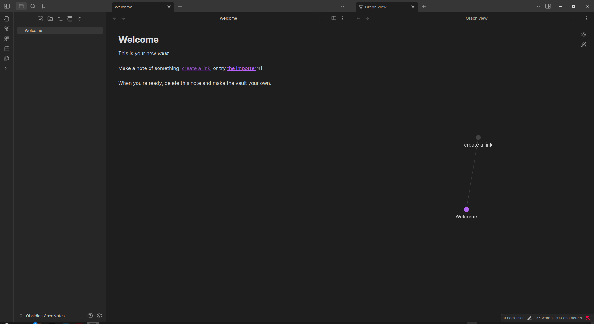

# Installation

Obsidian est disponible sur les systèmes iOS, Android, Windows, Mac, Linux. Il es également disponible au niveau des navigateurs sous forme d'extention du navigateur.

Pour installer Obsidian,

1. Rendez-vous sur la page [Obsidian/download](https://obsidian.md/download)
2. Cliquez sur l'environnement sur lequel vous voulez installler Obsidian pour le télécharger
3. Installer Obsidian sur votre machine :

* Sur Windows

Double cliquez sur l'exécutable Obsidian, puis suivez les instruction

* Sur Linux Debian/ ubuntu (deb)

```bash
sudo dpkg -i obsidian.deb
```

\*\* Création d'un coffre





* Présentation de l'interface de Obsidian


