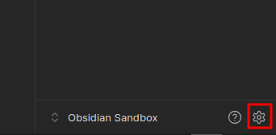

# Configuration

Pour la configuration de votre espace Obsidian, vous devez vous rendre au niveau des paramètres de l'application situé en bas à gauche de l'interface de Obsidian.

<figure><figcaption></figcaption></figure>

## Premiers réglages

Quelques paramètres qu'il est intéressant de configurer pour commencer.

* **Général > Rechercher les mises à jour :** pour vérifier que vous disposez de la dernière mise à jour
* **Général > Langue :** configurer la langue du logiciel

* **Éditeur > Mode par défaut pour les nouveaux onglets :** aperçu en direct pour bénéficier de la visualisation du rendu du code markdown pendant l'édition.
* **Éditeur > Vérification Orthographique :**  active le correcteur orthographique des textes.
* **Éditeur > Langues du correcteur :** défini les langues sur lesquelles doivent se baser le correcteur d'orthographe.

* **Fichiers & liens > Emplacement par défaut des nouvelles pièces jointes :** défini ou doit être rangé les pièces jointes à une note. Vous pouvez choisir l'option qui vous convient le mieux.&#x20;

> Si vous choisissez de ranger vos pièces jointes dans un dossier précis (un dossier commun, ou sous-dossier pour chaque dossier de notes), il vous sera demandé tout juste en bas de renseigner le nom du dossier.

* **Apparence > Thèmes :** choisir ou installer le thème qui convient ou rester sur le thème par défaut.
* **Apparence > Police : g**érer la police de l'interface, des textes

